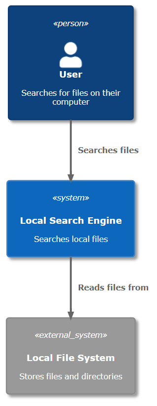
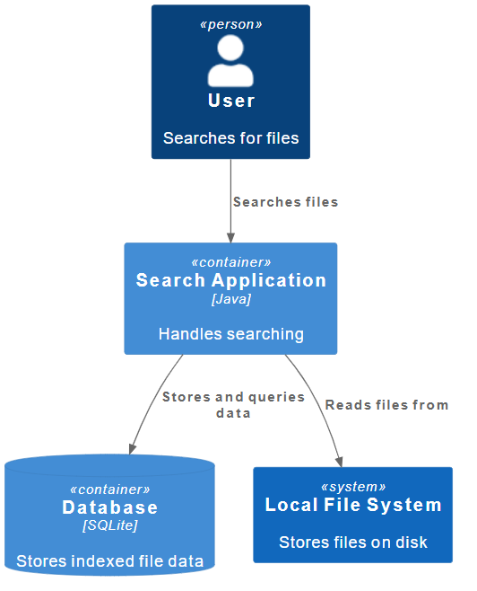
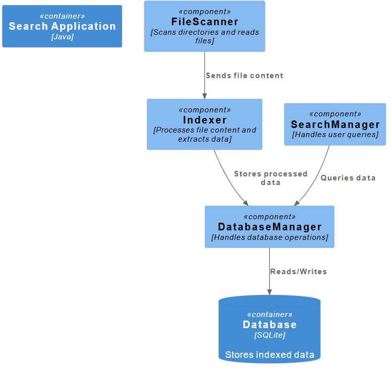

# Architecture

## 1. Context diagram

  

The context diagram shows the system and its relationship with users and other external systems.
It includes the User, the Search Engine and the File System (external). 

Relationships: 

User → Search Engine (searches)

Search Engine → File System (reads files).

---
## 2. Container Diagram

  

The system is decomposed into interrelated containers. This is the main building block of the system, representing the deployable parts: app, database, services. This diagram shows the main components and the relationships between them.
It includes the search application (Java app) and the database (SQLite). 

Relationships: 

The user uses the app.

The app reads the files.

The app communicates with the database.

App handles logic, Databases holds data.

---
## 3. Component Diagram

  

The containers are further decomposed into interrelated components. It shows the logical modules and responsibilities of the system, representing how the application is internally structured.
The component diagram includes the FileScanner (used to traverse files), Indexer (reads and processes content), SearchManager (search data), DatabaseManager (store data and talk to the database). 

Relationships: 

FileScanner→ Indexer → Database.

SearchManager → Database
